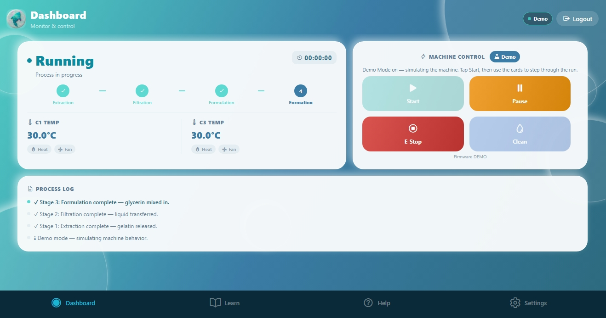

# BIO-FISH 🐟

**Control app for a machine that turns fish scales into bioplastic sheets.**

Fish scales are one of the most common waste products in Philippine wet markets. BIO-FISH is a machine that turns them into biodegradable plastic film across four automatic stages, run by an ESP32 microcontroller. This is the app that operates it — live status, remote control, and machine settings, on phone or in a browser.

🔗 **Live app:** [biofish-control.vercel.app](https://biofish-control.vercel.app)



## About this project

Two things sit side by side here, and it's worth being clear about which is which.

**The machine** is our engineering capstone — a team of four, and a 2026 APEAR Top 8 finalist.

**This app is not part of the thesis.** Our Software Design course required us to build a working application, so instead of building something disposable, I proposed we build the control interface our own machine actually needed. One piece of work, two purposes. I led the development.

## What the machine does

| Stage | What happens |
|---|---|
| 1 · Extraction | Heats fish scales in water to release gelatin. |
| 2 · Filtration | Pumps the gelatin liquid through filters into the next container. |
| 3 · Formulation | Adds glycerin as a plasticizer and mixes with heat so the film stays flexible. |
| 4 · Film Formation | Pours the mixture into trays to dry into thin bioplastic sheets. |

## Hardware status — read this before judging the demo

The app talks to the ESP32 through Supabase: the machine writes its status to one table, and the app writes commands to another that the machine reads and clears.

**Version 1 of this app was demonstrated controlling the physical machine end to end** — live temperatures, stage progress, and remote start, pause, and emergency stop.

**Version 2 — the current code — has not been re-tested against the hardware.** Both the firmware and the app interface were rewritten, and I no longer have access to the machine. So the pairing works in principle and worked in v1, but I can't claim the current build has been verified against the real thing, and I'd rather say so than let someone find out during a demo.

What you *can* see working right now is **Demo Mode**, a scripted simulation of a full production run — every stage, temperature curve, and operator decision point, with no hardware required. It was built so the panel could see the interface behave during defense, and it's also how the live web link works today.

## Features

- **Dashboard** — live status, container temperatures, stage progress, process log, and controls (Start, Pause, E-Stop, Clean).
- **Operator decision points** — when the volume sensor reads outside the expected 1500–2500 mL range, the machine retries three times and then hands the decision to the operator: retry, skip, or stop. Same for heat overrun and tray dispensing. The machine never guesses on the operator's behalf.
- **Demo Mode** — a full simulated run for testing and demonstrations.
- **Settings** — eight machine parameters (water volume, mix times, temperature ceilings, glycerin percentage, clean and drain durations), matched to the firmware defaults.
- **Learn and Help** — what each stage does, a how-to guide, FAQ, WiFi setup steps, and troubleshooting.
- **Cross-platform** — one codebase running on Android (EAS Build) and the web (Vercel).

## Tech stack

| Part | What we use |
|---|---|
| App framework | React Native + Expo (SDK 54) |
| Database + realtime | Supabase (Postgres, RLS, realtime subscriptions) |
| Web hosting | Vercel |
| Mobile build | EAS Build (Android APK) |
| Machine | ESP32 microcontroller |

## How the app and machine talk

```
ESP32  ──writes status──►  machine_status   ──realtime push──►  App
ESP32  ◄──reads/clears──   machine_commands ◄──writes────────   App
                            machine_settings  ◄── both ──►
```

| Table | Holds |
|---|---|
| `machine_status` | Live temps, current stage, substep, last-seen timestamp |
| `machine_commands` | Commands from the app; the machine reads then deletes them |
| `machine_settings` | The eight parameters |

All three have Row Level Security enabled with realtime turned on. The command table is a queue rather than a flag, so a dropped connection can't leave the machine stuck acting on a stale instruction.

**Online detection** is based on the machine's `last_seen` timestamp rather than a connection state, because a device on flaky WiFi can look connected while having stopped reporting.

## Design

A custom claymorphism system — soft shadows, rounded surfaces, and an underwater bubble background, in keeping with the fish-scale origin. Colors and spacing live in `app/constants/`, and every screen and component is its own file.

## Project structure

```
biofish-control/
├── App.js                   # entry — splash, login, tab navigation
├── app/
│   ├── screens/             # one file per screen
│   │   ├── SplashScreen.js
│   │   ├── LoginScreen.js
│   │   ├── DashboardScreen.js   # live status, controls, demo engine
│   │   ├── LearnScreen.js
│   │   ├── HelpScreen.js
│   │   └── SettingsScreen.js
│   ├── components/          # AppHeader, BubbleBackground
│   ├── constants/           # colors.js, theme.js — the design system
│   └── lib/supabase.js      # Supabase client
├── web/index.html
└── assets/
```

## Running it yourself

You need Node.js, and the Expo Go app on your phone matching **SDK 54**.

```bash
git clone https://github.com/angelinetipa/biofish-control.git
cd biofish-control
npm install
```

Create a `.env` file in the project root with your own Supabase project details:

```
EXPO_PUBLIC_SUPABASE_URL=your_supabase_url
EXPO_PUBLIC_SUPABASE_ANON_KEY=your_anon_key
EXPO_PUBLIC_ACCESS_PIN=your_pin
EXPO_PUBLIC_ADMIN_PIN=your_admin_pin
```

Then:

```bash
npx expo start     # phone, via Expo Go
npm run web        # browser
```

`.env` is gitignored and must stay that way.

## Honest notes on the auth

Access is a single shared PIN, no usernames — a deliberate choice for a lab machine operated by a small team standing next to it, where individual accounts would have added friction without adding safety.

It is not real authentication, and I wouldn't ship it as such. `EXPO_PUBLIC_` variables are bundled into the build, so the PIN is obscurity rather than security. The correct fix is server-side verification through Supabase auth with the PIN never reaching the client. That's the first thing I'd change given more time.

## What I'd do differently

- **Verify v2 against the hardware.** The gap above is the one real weakness in this project.
- **Move auth server-side**, as described.
- **Add tests.** There are none. The demo engine and the status-parsing logic are pure functions and would be straightforward to cover.
- **Finish the two-column web layout**, which was postponed near the deadline.

## Team

Martinez · Ragaas · Sanclaria · Tipa (lead developer, this app)

Polytechnic University of the Philippines — Sta. Mesa, Manila
CMPE 407, AY 2025–2026

---

Built by [Angeline Tipa](https://github.com/angelinetipa).